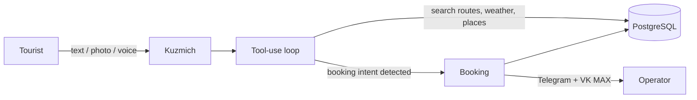

# TourHab -- AI-powered tourism platform for Kamchatka

*Where volcanoes meet the ocean — and AI plans your trip there.*

**[tourhab.ru](https://tourhab.ru)** · 260 routes · 455 API endpoints · live in production

Most travel sites show you a list. Kuzmich asks what you want, reads your photos, books the tour, and notifies the operator — all in one conversation.

---

## What it does

- **Kuzmich AI** -- multi-channel assistant (Telegram, web widget, full-page chat). Understands photos (vision), voice messages (transcription), recommends tours, handles bookings inline
- **260+ routes** -- hiking, volcanoes, fishing, bear watching, helicopter tours, rafting, thermal springs, diving, snowmobiles
- **Inline booking** -- tourist describes what they want in natural language, AI matches the tour, collects details, creates booking, notifies operator
- **Operator dashboards** -- booking management, earnings, tour editor, calendar
- **Safety system** -- SOS button, route danger warnings, MChS integration
- **AI agents** -- Watchdog (stale bookings alerts), Editor (AI description enrichment), Scout Digest (industry news), Intelligence Monitor (competitor & tech tracking)
- **Fish encyclopedia** -- 15 Kamchatka fish species with fishing tour links
- **Affiliate blocks** -- flights (Aviasales), hotels (Hotellook), insurance (Cherehapa), transfers (Kiwitaxi) embedded in route pages

**Kuzmich in action:**

> *"Хочу увидеть медведей, но боюсь одна"*
>
> Kuzmich подбирает групповой тур на Курильское озеро, объясняет маршрут, предлагает страховку под активность, создаёт бронирование и оповещает оператора — без единой формы.

---

## Architecture

```
Next.js 15 App Router + TypeScript strict
PostgreSQL (raw SQL, no ORM)
JWT auth + role-based middleware
AI waterfall (OpenRouter -> DeepSeek -> Gemini -> MiniMax -> Anthropic)
Telegram Bot API (Kuzmich tourists + TOURHAB_BOT operators)
VK MAX integration (operator notifications)
Timeweb Cloud deploy (auto-deploy on push)
```

### Data flow



### Scale

| Metric | Count |
|--------|-------|
| TypeScript files | 1,150+ |
| API routes | 455 |
| UI components | 143 |
| SQL migrations | 122 |
| Lines of code | 195k+ |
| Tour routes in DB | 260+ |

Raw SQL without ORM is an intentional choice: the schema is complex (260 routes, 8 hubs, multiple roles), queries stay explicit and auditable, and there's no hidden N+1 or migration magic to debug in production.

### Key modules

```
app/
  kuzmich/              -- AI chat (full-page)
  marketplace/          -- Tour catalog
  routes/[id]/          -- Tour detail + affiliate blocks
  fish/                 -- Fish encyclopedia (15 species)
  hub/admin/            -- Platform admin (analytics, operators, AI analytics)
  hub/operator/         -- Operator dashboard (bookings, tours, earnings)
  hub/tourist/          -- Tourist profile (bookings, favorites)
  hub/safety/           -- Safety center
  api/cron/             -- Background agents (watchdog, editor, scout, intelligence)

lib/
  kuzmich/core.ts       -- Kuzmich brain (agent loop, tools, booking flow)
  ai/providers.ts       -- AI provider waterfall (6 providers, auto-failover)
  agents/               -- Background agents (watchdog, editor, scout-digest)
  services/             -- Domain services (insurance, flights, hotels, transfers)
```

## AI stack

Kuzmich uses a multi-level architecture:

1. **Tool-use agent loop** -- 4 tools (search tours, get place info, get weather, search Kamchatka knowledge base). Up to 4 tool calls per turn
2. **Waterfall fallback** -- if agent loop fails, falls back to simple completion with tour context
3. **Vision** -- photo recognition via Gemini (through OpenRouter)
4. **Voice** -- transcription via Gemini, then standard processing
5. **Memory** -- per-user notes synthesized every 5 messages, stored in DB
6. **Booking detection** -- NLU triggers inline booking flow with context-aware tour matching

### Background agents

| Agent | Schedule | Role |
|-------|----------|------|
| Watchdog | every 30 min | Stale bookings (>24h), slow operators (>48h), cold leads (>2h) → Telegram alerts |
| Editor | 02:00 UTC | Tours with thin descriptions → AI rewrites → `route_description_cache` |
| Scout Digest | 07:00 UTC | RSS (Habr, RATA, Tourprom, Kamgov) → AI synthesis → Telegram digest |
| Intelligence Monitor | every 6h | AI/tech + travel industry + competitors → agent_memory + Telegram |

## Local development

```bash
git clone https://github.com/pospkam/PosPkTry.git
cd PosPkTry
npm install
cp .env.example .env.local  # fill in DATABASE_URL, OR_API_KEY, etc.
npm run dev
```

### Required env vars

```
DATABASE_URL          -- PostgreSQL connection string
OR_API_KEY            -- OpenRouter API key (primary AI provider)
DEEPSEEK_API_KEY      -- DeepSeek fallback
JWT_SECRET            -- Auth signing key
TELEGRAM_BOT_TOKEN    -- Kuzmich bot token (tourists)
TOURHAB_BOT_TOKEN     -- Operator notifications bot
CRON_SECRET           -- Background agents auth
```

### Commands

```bash
npm run dev           # Dev server
npm run build         # Production build
npx tsc --noEmit      # Type check
npm test              # Tests (214 passing)
```

## Design system

Warm, earthy, premium. No glassmorphism, no cyberpunk.

- **Fonts**: Playfair Display (headings) + Outfit (body)
- **Palette**: CSS custom properties with full dark mode support
- **Accent**: `#D44A0C` (volcanic orange)
- **Components**: `ds-card`, `ds-btn`, `ds-input`, `ds-badge`, `ds-skeleton`
- **Icons**: lucide-react only

## Tech stack

| Layer | Technology |
|-------|-----------|
| Framework | Next.js 15 (App Router) |
| Language | TypeScript (strict mode) |
| Styling | Tailwind CSS + design tokens |
| Database | PostgreSQL (parameterized SQL) |
| Auth | JWT + role middleware |
| AI | OpenRouter, DeepSeek, Gemini, MiniMax, Anthropic |
| Payments | Tochka Bank QR |
| Bots | Telegram Bot API, VK MAX |
| Deploy | Timeweb Cloud |
| CI/CD | GitHub auto-deploy |

## Roadmap

**Done**
- Kuzmich AI — Telegram, web widget, full-page chat
- Inline booking flow with operator notifications
- Operator dashboards (bookings, earnings, tours, calendar)
- Affiliate blocks — flights, hotels, insurance, transfers
- 4 background AI agents (Watchdog, Editor, Scout, Intelligence)
- Fish encyclopedia (15 Kamchatka species)

**In progress**
- Phase 3: extras — activities, car rentals

**Planned**
- Phase 4: real-time API pricing (live Aviasales / Hotellook rates)
- Full Tochka Bank payment flow
- Mobile app (PWA)

## Status

Live in production and shipping weekly.

**[tourhab.ru](https://tourhab.ru)**

---

Built for Kamchatka. Where volcanoes meet the ocean.
