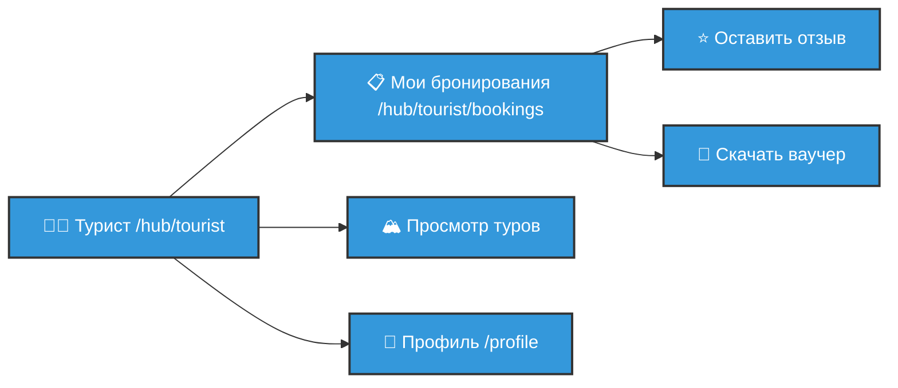
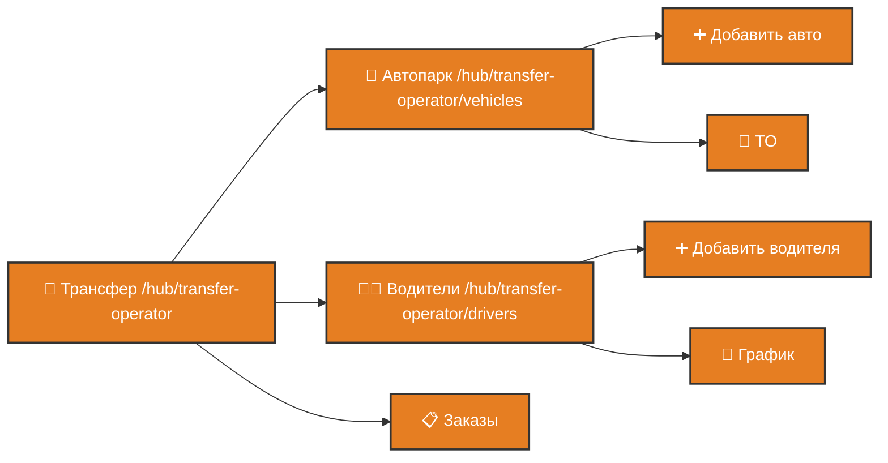
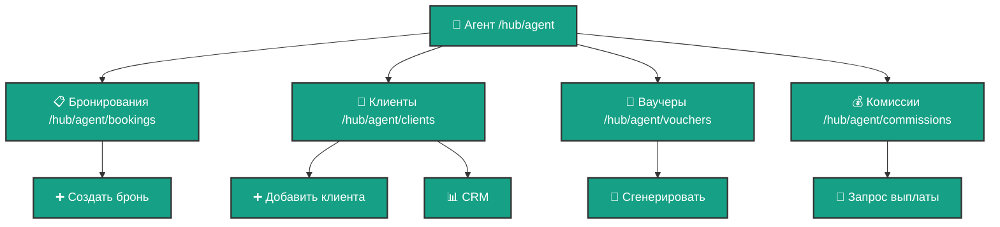
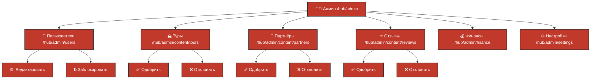
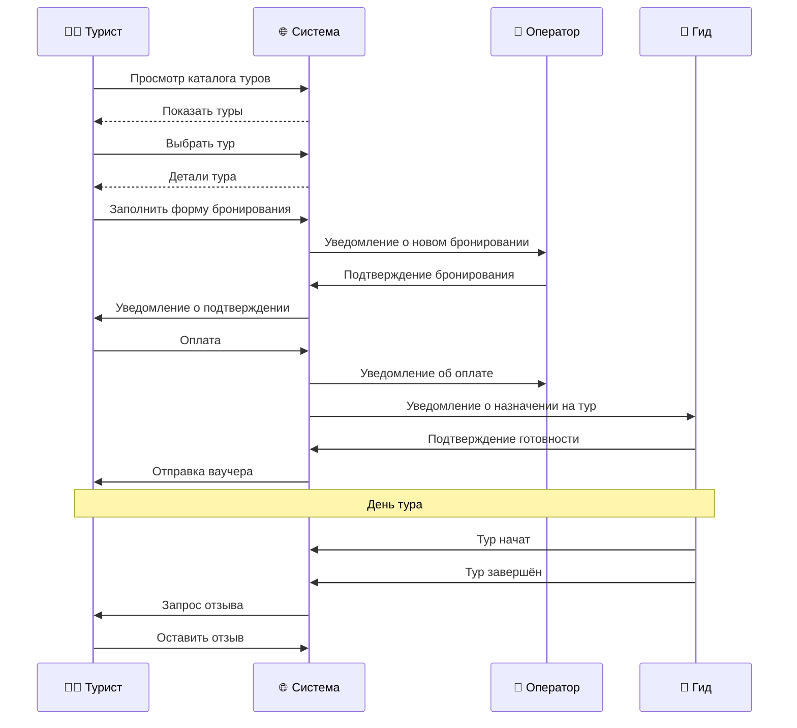
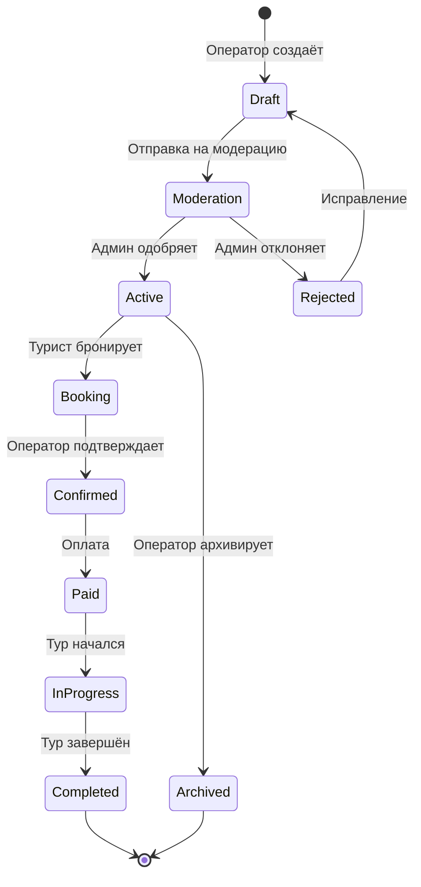
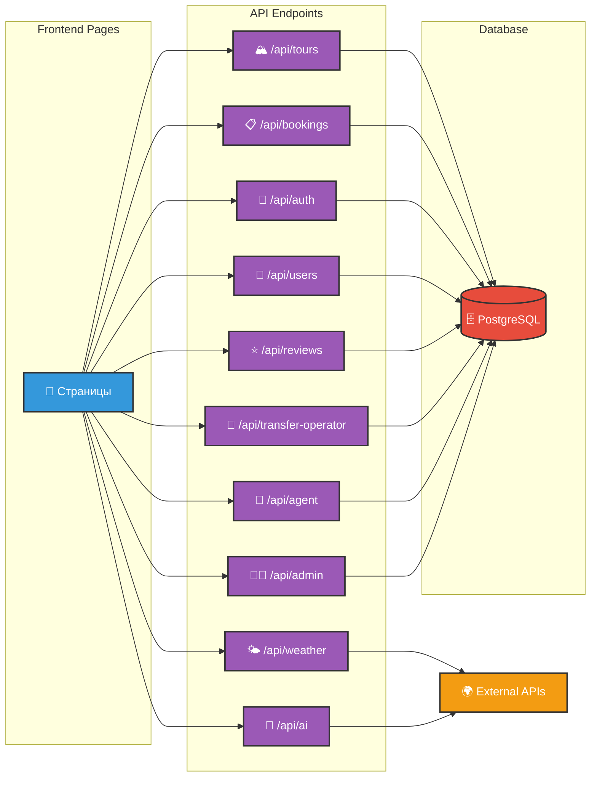
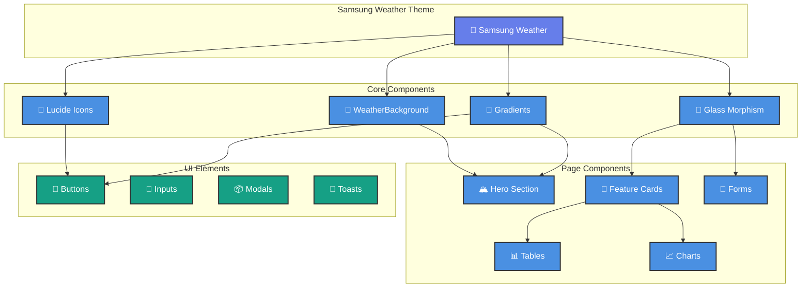
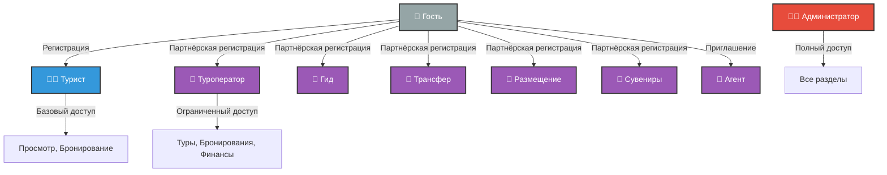
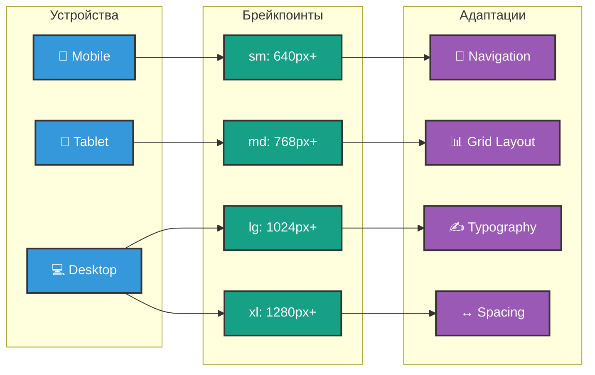

# 📈 ВИЗУАЛЬНАЯ СХЕМА ВСЕХ СТРАНИЦ KAMCHATOUR

**Интерактивная диаграмма структуры проекта**

---

## 🗺️ ГЛАВНАЯ НАВИГАЦИОННАЯ СХЕМА

```mermaid
graph TB
    HOME[🏠 Главная /]
    
    %% Публичные страницы
    HOME --> TOURS[🏔️ Каталог туров /tours]
    HOME --> SEARCH[🔍 Поиск /search]
    HOME --> CARS[🚗 Прокат авто /cars]
    HOME --> GEAR[⛏️ Снаряжение /gear]
    HOME --> SHOP[🎁 Сувениры /shop]
    HOME --> DEMO[🤖 AI-демо /demo]
    
    TOURS --> TOUR_DETAIL[📄 Тур /tours/[id]]
    
    %% Авторизация
    HOME --> LOGIN[🔐 Вход /auth/login]
    
    %% Партнёры
    HOME --> PARTNER_REG[📝 Регистрация партнёра /partner/register]
    PARTNER_REG --> PARTNER_DASH[📊 Дашборд партнёра /partner/dashboard]
    
    %% Hub - главный узел
    LOGIN --> HUB_TOURIST[👨‍💼 Турист /hub/tourist]
    LOGIN --> HUB_OPERATOR[🏢 Оператор /hub/operator]
    LOGIN --> HUB_GUIDE[🎒 Гид /hub/guide]
    LOGIN --> HUB_TRANSFER[🚗 Трансфер /hub/transfer-operator]
    LOGIN --> HUB_AGENT[🔧 Агент /hub/agent]
    LOGIN --> HUB_ADMIN[👨‍💼 Админ /hub/admin]
    
    %% Стили
    classDef public fill:#4a90e2,stroke:#333,stroke-width:2px,color:#fff
    classDef auth fill:#f39c12,stroke:#333,stroke-width:2px,color:#fff
    classDef hub fill:#9b59b6,stroke:#333,stroke-width:2px,color:#fff
    classDef partner fill:#16a085,stroke:#333,stroke-width:2px,color:#fff
    
    class HOME,TOURS,SEARCH,CARS,GEAR,SHOP,DEMO,TOUR_DETAIL public
    class LOGIN auth
    class PARTNER_REG,PARTNER_DASH partner
    class HUB_TOURIST,HUB_OPERATOR,HUB_GUIDE,HUB_TRANSFER,HUB_AGENT,HUB_ADMIN hub
```

---

## 👨‍💼 ТУРИСТ (TOURIST)



---

## 🏢 ТУРОПЕРАТОР (OPERATOR)

```mermaid
graph TB
    OPERATOR[🏢 Оператор /hub/operator]
    
    OPERATOR --> TOURS_MANAGE[🏔️ Управление турами /hub/operator/tours]
    OPERATOR --> BOOKINGS[📋 Бронирования /hub/operator/bookings]
    OPERATOR --> CALENDAR[📅 Календарь /hub/operator/calendar]
    OPERATOR --> FINANCE[💰 Финансы /hub/operator/finance]
    OPERATOR --> TRANSFER[🚐 Трансферы /hub/operator/transfer]
    
    TOURS_MANAGE --> NEW_TOUR[➕ Создать тур /hub/operator/tours/new]
    TOURS_MANAGE --> EDIT_TOUR[✏️ Редактировать /hub/operator/tours/[id]]
    
    BOOKINGS --> CONFIRM[✅ Подтвердить]
    BOOKINGS --> REJECT[❌ Отклонить]
    BOOKINGS --> CONTACT[📧 Связаться]
    
    classDef operator fill:#9b59b6,stroke:#333,stroke-width:2px,color:#fff
    class OPERATOR,TOURS_MANAGE,BOOKINGS,CALENDAR,FINANCE,TRANSFER,NEW_TOUR,EDIT_TOUR,CONFIRM,REJECT,CONTACT operator
```

---

## 🚗 ТРАНСФЕР-ОПЕРАТОР (TRANSFER)



---

## 🔧 АГЕНТ (AGENT)



---

## 👨‍💼 АДМИНИСТРАТОР (ADMIN)



---

## 🎯 ПОТОКИ БРОНИРОВАНИЯ



---

## 🔄 ЖИЗНЕННЫЙ ЦИКЛ ТУРА



---

## 📊 API ВЗАИМОДЕЙСТВИЯ



---

## 🎨 ДИЗАЙН-СИСТЕМА



---

## 🔐 СИСТЕМА РОЛЕЙ И ДОСТУПА



---

## 📱 АДАПТИВНОСТЬ



---

## 📈 СТАТИСТИКА ПРОЕКТА

| Категория | Количество |
|-----------|------------|
| **Всего страниц** | 50 |
| **API endpoints** | 106 |
| **Компонентов** | 150+ |
| **Роли** | 8 |
| **Публичные страницы** | 10 |
| **Hub страницы** | 39 |
| **React иконки (Lucide)** | 80+ |
| **CSS файлы** | 3 (globals, theme, dynamic) |
| **TypeScript файлов** | 200+ |

---

## 🎯 КЛЮЧЕВЫЕ ОСОБЕННОСТИ

✅ **Полностью БЕЗ эмодзи** - только Lucide React иконки  
✅ **Samsung Weather дизайн** - премиальный UI/UX  
✅ **Адаптивный** - все устройства (mobile-first)  
✅ **Типизированный** - 100% TypeScript  
✅ **Модульный** - переиспользуемые компоненты  
✅ **SEO-оптимизированный** - метатеги, структура  
✅ **Производительный** - Next.js App Router, SSR  
✅ **Безопасный** - защита маршрутов, валидация  

---

**Дата создания:** 27 ноября 2025  
**Формат:** Mermaid Diagrams  
**Версия:** 1.0
