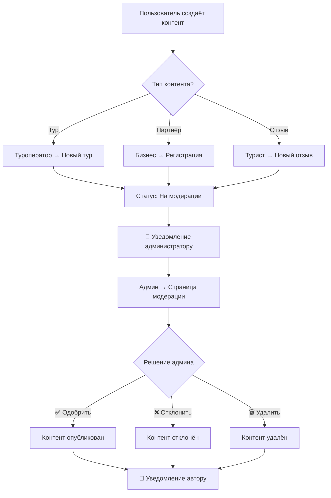

# 📝 КАК АДМИНИСТРАТОР МОДЕРИРУЕТ КОНТЕНТ

**Дата:** 27 ноября 2025  
**Роль:** Администратор  
**Страниц модерации:** 3  

---

## 🎯 ОБЗОР СИСТЕМЫ МОДЕРАЦИИ

Администратор модерирует контент на **3 специальных страницах** в разделе `/hub/admin/content/`:

1. **🏔️ Модерация туров** → `/hub/admin/content/tours`
2. **🏢 Модерация партнёров** → `/hub/admin/content/partners`
3. **⭐ Модерация отзывов** → `/hub/admin/content/reviews`

---

## 🏔️ 1. МОДЕРАЦИЯ ТУРОВ

### 📍 Страница
**URL:** `/hub/admin/content/tours`  
**Файл:** `app/hub/admin/content/tours/page.tsx`  
**API:** `app/api/admin/content/tours/`

---

### 🎯 Что модерирует администратор

**Туры, созданные туроператорами:**
- Новые туры (перед публикацией)
- Изменённые туры (после редактирования)
- Неактивные туры (проверка причины)
- Жалобы на туры

---

### 📊 Что видит администратор в таблице

**Колонки таблицы:**

| Колонка | Описание | Данные |
|---------|----------|--------|
| **Название** | Название тура | Текст + превью |
| **Оператор** | Кто создал | Имя туроператора |
| **Сложность** | Уровень | Легко / Средне / Сложно |
| **Длительность** | Время | Часы / Дни |
| **Цена** | Стоимость | ₽ / $ / € |
| **Рейтинг** | Оценка | ⭐ 0-5 (кол-во отзывов) |
| **Статус** | Состояние | Активный / Неактивный |
| **Действия** | Кнопки | Переключатель / Архив / Просмотр |

---

### 🔍 Инструменты модерации

#### 1. Поиск
```tsx
<SearchBar 
  placeholder="Поиск по названию тура..."
  onSearch={handleSearch}
/>
```
**Ищет по:**
- Название тура
- ID тура
- Имя оператора (опционально)

---

#### 2. Фильтры

**Фильтр по статусу:**
- 🔵 Все туры
- ✅ Активные (active)
- ⏸️ Неактивные (inactive)

**Фильтр по сложности (если добавлен):**
- 🟢 Легко (easy)
- 🟡 Средне (medium)
- 🔴 Сложно (hard)

---

#### 3. Сортировка

**Сортировка по колонкам:**
- По названию (А-Я)
- По дате создания (новые/старые)
- По цене (дешевые/дорогие)
- По рейтингу (лучшие/худшие)

---

### ⚡ Действия администратора

#### 1️⃣ **Активировать / Деактивировать тур**

**Кнопка:** Переключатель (Toggle)

```tsx
const handleToggleActive = async (tourId: string, currentStatus: boolean) => {
  const response = await fetch(`/api/admin/content/tours/${tourId}`, {
    method: 'PUT',
    headers: { 'Content-Type': 'application/json' },
    body: JSON.stringify({ isActive: !currentStatus })
  });
  
  if (response.ok) {
    fetchTours(); // Обновить список
  }
};
```

**Что делает:**
- ✅ Активный → тур виден всем пользователям
- ⏸️ Неактивный → тур скрыт (только оператор видит)

**Когда использовать:**
- ✅ Одобрить новый тур
- ⏸️ Временно скрыть тур (проблемы, жалобы)

---

#### 2️⃣ **Архивировать тур**

**Кнопка:** "Архивировать" (с подтверждением)

```tsx
const handleArchive = async (tourId: string) => {
  if (!confirm('Вы уверены, что хотите архивировать этот тур?')) return;
  
  const response = await fetch(`/api/admin/content/tours/${tourId}`, {
    method: 'DELETE'
  });
  
  if (response.ok) {
    fetchTours();
  }
};
```

**Что делает:**
- 🗑️ Переводит тур в архив
- ❌ Удаляет из публичного каталога
- 📦 Сохраняет данные (не удаляет полностью)

**Когда использовать:**
- Нарушение правил
- Мошенничество
- Фейковый тур
- Жалобы клиентов

---

#### 3️⃣ **Просмотреть детали**

**Кнопка:** "Просмотр" (иконка глаза 👁️)

**Что видит:**
- Полное описание тура
- Маршрут
- Цены
- Изображения (галерея)
- Включено/не включено
- Требования
- Отзывы
- Статистика (просмотры, бронирования)

---

### 📋 Пример работы администратора

**Сценарий: Новый тур на модерации**

1. **Получение уведомления:**
   - Туроператор создал тур "Восхождение на Авачинский вулкан"
   - Статус: неактивный (ожидает проверки)

2. **Проверка администратором:**
   ```
   Администратор → /hub/admin/content/tours
   → Находит тур в списке
   → Кликает "Просмотр" 👁️
   ```

3. **Что проверяет:**
   - ✅ Корректное название
   - ✅ Подробное описание
   - ✅ Реальные фото (не из интернета)
   - ✅ Адекватная цена
   - ✅ Правдивые характеристики
   - ✅ Безопасность (требования)
   - ✅ Юридические данные оператора

4. **Решение:**
   - ✅ **Одобрить** → переключить Toggle в "Активный"
   - ❌ **Отклонить** → оставить неактивным + связаться с оператором
   - 🗑️ **Архивировать** → нарушение правил

5. **Результат:**
   - ✅ Тур появился в публичном каталоге `/tours`
   - 📧 Оператор получил уведомление

---

### 🔄 API для модерации туров

**Endpoints:**

```bash
# Получить список туров
GET /api/admin/content/tours?page=1&limit=20&status=all

# Получить детали тура
GET /api/admin/content/tours/[id]

# Активировать/деактивировать
PUT /api/admin/content/tours/[id]
Body: { "isActive": true/false }

# Архивировать (удалить)
DELETE /api/admin/content/tours/[id]
```

---

## 🏢 2. МОДЕРАЦИЯ ПАРТНЁРОВ

### 📍 Страница
**URL:** `/hub/admin/content/partners`  
**Файл:** `app/hub/admin/content/partners/page.tsx`  
**API:** `app/api/admin/content/partners/`

---

### 🎯 Что модерирует администратор

**Партнёров (бизнес-аккаунты):**
- Новые регистрации партнёров
- Обновление данных (ИНН, документы)
- Верификация партнёров
- Жалобы на партнёров

---

### 📊 Что видит администратор в таблице

**Колонки таблицы:**

| Колонка | Описание | Данные |
|---------|----------|--------|
| **Название** | Компания + логотип | Текст + изображение |
| **Категория** | Тип партнёра | Размещение / Туроператор / Трансфер / Гид / Сувениры |
| **Контакт** | Email/телефон | Контактные данные |
| **Рейтинг** | Оценка | ⭐ 0-5 (кол-во отзывов) |
| **Верификация** | Проверен | ✅ Верифицирован / ⏳ На проверке |
| **Действия** | Кнопки | Верифицировать / Просмотр / Редактировать |

---

### 🔍 Инструменты модерации

#### 1. Поиск
**Ищет по:**
- Название компании
- Email
- Телефон
- ИНН/ОГРН (если добавлено)

---

#### 2. Фильтры

**Фильтр по категории:**
- 🏨 Размещение (accommodation)
- 🏢 Туроператор (tour_operator)
- 🚗 Трансфер (transfer)
- 🎒 Гид (guide)
- 🎁 Сувениры (souvenir)
- ⛏️ Снаряжение (gear)
- 🍽️ Ресторан (restaurant)

**Фильтр по верификации:**
- 🔵 Все
- ✅ Верифицированные (verified)
- ⏳ На проверке (pending)
- ❌ Отклонённые (rejected)

---

### ⚡ Действия администратора

#### 1️⃣ **Верифицировать партнёра**

**Кнопка:** "Верифицировать" (галочка ✅)

```tsx
const handleVerify = async (partnerId: string) => {
  const response = await fetch(`/api/admin/content/partners/${partnerId}/verify`, {
    method: 'POST'
  });
  
  if (response.ok) {
    fetchPartners(); // Обновить список
  }
};
```

**Что делает:**
- ✅ Устанавливает статус "Верифицирован"
- 🏆 Партнёр получает бейдж "Проверено"
- 📧 Уведомление партнёру
- 🚀 Полный доступ к функциям

**Что проверяется:**
- 📄 Юридические документы (ИНН, ОГРН, лицензии)
- 🏢 Реальность компании (проверка по базам)
- 📞 Контактные данные (звонок)
- 💼 Банковские реквизиты
- 📝 Договор оферты (подписание)

---

#### 2️⃣ **Просмотреть детали партнёра**

**Кнопка:** "Просмотр" (👁️)

**Что видит:**
- 🏢 Информация о компании
- 📄 Юридические данные
- 📞 Контакты
- 💼 Банковские реквизиты
- 📊 Статистика:
  - Количество туров/услуг
  - Выручка
  - Количество бронирований
  - Средний рейтинг
- ⭐ Отзывы клиентов
- 📧 История переписки

---

#### 3️⃣ **Отклонить партнёра**

**Когда отклонять:**
- ❌ Фейковые документы
- ❌ Нет юридической регистрации
- ❌ Недостоверные данные
- ❌ Мошенничество
- ❌ Нарушение правил

**Действие:**
- Отправка причины отклонения
- Блокировка аккаунта
- Уведомление партнёра

---

### 📋 Пример работы администратора

**Сценарий: Новый партнёр регистрируется**

1. **Регистрация:**
   - Компания "Камчатские Приключения ООО" зарегистрировалась
   - Тип: Туроператор
   - Статус: На проверке

2. **Проверка администратором:**
   ```
   Администратор → /hub/admin/content/partners
   → Фильтр: "На проверке"
   → Находит "Камчатские Приключения ООО"
   → Кликает "Просмотр" 👁️
   ```

3. **Что проверяет:**
   - ✅ ИНН: 4101234567 (проверка в базе ФНС)
   - ✅ ОГРН: 1234567890123
   - ✅ Юридический адрес
   - ✅ Директор: Иванов И.И.
   - ✅ Лицензия туроператора (если требуется)
   - ✅ Банковские реквизиты
   - ✅ Телефон (звонок для подтверждения)
   - ✅ Email (проверка домена)

4. **Решение:**
   - ✅ **Верифицировать** → кнопка "Верифицировать"
   - ❌ **Отклонить** → кнопка "Отклонить" + причина

5. **Результат:**
   - ✅ Партнёр верифицирован
   - 🏆 Бейдж "Проверено" на профиле
   - 📧 Email: "Поздравляем! Вы верифицированы"
   - 🚀 Доступ к созданию туров

---

### 🔄 API для модерации партнёров

**Endpoints:**

```bash
# Получить список партнёров
GET /api/admin/content/partners?page=1&limit=20&verified=pending

# Получить детали партнёра
GET /api/admin/content/partners/[id]

# Верифицировать
POST /api/admin/content/partners/[id]/verify

# Обновить данные
PATCH /api/admin/content/partners/[id]

# Удалить (блокировать)
DELETE /api/admin/content/partners/[id]
```

---

## ⭐ 3. МОДЕРАЦИЯ ОТЗЫВОВ

### 📍 Страница
**URL:** `/hub/admin/content/reviews`  
**Файл:** `app/hub/admin/content/reviews/page.tsx`  
**API:** `app/api/admin/content/reviews/`

---

### 🎯 Что модерирует администратор

**Отзывы туристов:**
- Новые отзывы (перед публикацией)
- Жалобы на отзывы
- Спам и фейковые отзывы
- Оскорбления и мат

---

### 📊 Что видит администратор в таблице

**Колонки таблицы:**

| Колонка | Описание | Данные |
|---------|----------|--------|
| **Пользователь** | Кто написал | Имя туриста |
| **Тур** | О каком туре | Название тура |
| **Оценка** | Рейтинг | ⭐⭐⭐⭐⭐ (1-5) |
| **Комментарий** | Текст | Текст отзыва (truncate) |
| **Дата** | Когда написан | DD.MM.YYYY |
| **Статус** | Состояние | ✅ Одобрен / ⏳ На проверке / ❌ Отклонён |
| **Действия** | Кнопки | Одобрить / Удалить / Просмотр |

---

### 🔍 Инструменты модерации

#### Фильтры

**Фильтр по верификации:**
- 🔵 Все отзывы
- ✅ Одобренные (verified)
- ⏳ На модерации (pending)
- ❌ Отклонённые (rejected)

**Фильтр по оценке (опционально):**
- ⭐⭐⭐⭐⭐ 5 звёзд
- ⭐⭐⭐⭐ 4 звезды
- ⭐⭐⭐ 3 звезды
- ⭐⭐ 2 звезды
- ⭐ 1 звезда

---

### ⚡ Действия администратора

#### 1️⃣ **Одобрить отзыв**

**Кнопка:** "Одобрить" (✅)

```tsx
const handleModerate = async (reviewId: string, action: 'approve' | 'delete') => {
  const response = await fetch(`/api/admin/content/reviews/${reviewId}/moderate`, {
    method: 'POST',
    headers: { 'Content-Type': 'application/json' },
    body: JSON.stringify({ action })
  });
  
  if (response.ok) {
    fetchReviews(); // Обновить список
  }
};
```

**Что делает:**
- ✅ Отзыв становится видимым всем
- 📊 Обновляется рейтинг тура
- 📧 Уведомление автору отзыва

**Когда одобрять:**
- ✅ Конструктивный отзыв
- ✅ Реальный опыт
- ✅ Без мата и оскорблений
- ✅ Соответствует правилам

---

#### 2️⃣ **Отклонить / Удалить отзыв**

**Кнопка:** "Удалить" (🗑️ с подтверждением)

```tsx
if (action === 'delete' && !confirm('Вы уверены, что хотите удалить этот отзыв?')) {
  return;
}
```

**Что делает:**
- ❌ Отзыв удаляется
- 📊 Рейтинг тура пересчитывается
- 📧 Уведомление автору (опционально)

**Когда удалять:**
- ❌ Спам
- ❌ Фейковый отзыв
- ❌ Оскорбления, мат
- ❌ Рекламные ссылки
- ❌ Нарушение правил
- ❌ Не по теме

---

#### 3️⃣ **Просмотреть полный отзыв**

**Кнопка:** "Просмотр" (👁️)

**Что видит:**
- 👤 Автор отзыва (имя, email)
- 🏔️ Тур (название, оператор)
- ⭐ Оценка (1-5)
- 📝 Полный текст отзыва
- 📅 Дата написания
- 📷 Фото (если прикреплены)
- 📊 История модерации

---

### 📋 Пример работы администратора

**Сценарий: Новый отзыв на модерации**

1. **Турист оставил отзыв:**
   - Тур: "Восхождение на Авачинский вулкан"
   - Оценка: ⭐⭐⭐⭐⭐ 5 звёзд
   - Текст: "Отличный тур! Гид Иван очень профессиональный..."
   - Статус: На модерации

2. **Проверка администратором:**
   ```
   Администратор → /hub/admin/content/reviews
   → Фильтр: "На модерации"
   → Находит новый отзыв
   → Кликает "Просмотр" 👁️
   ```

3. **Что проверяет:**
   - ✅ Отзыв написан после реального тура (проверка в базе бронирований)
   - ✅ Текст конструктивный
   - ✅ Нет мата и оскорблений
   - ✅ Нет рекламных ссылок
   - ✅ Соответствует теме

4. **Решение:**
   - ✅ **Одобрить** → кнопка "Одобрить" ✅
   - ❌ **Удалить** → кнопка "Удалить" 🗑️

5. **Результат:**
   - ✅ Отзыв опубликован на странице тура
   - 📊 Рейтинг тура обновлён (4.7 → 4.8)
   - 📧 Email автору: "Ваш отзыв опубликован!"

---

### 🔄 API для модерации отзывов

**Endpoints:**

```bash
# Получить список отзывов
GET /api/admin/content/reviews?page=1&limit=20&verified=pending

# Получить детали отзыва
GET /api/admin/content/reviews/[id]

# Одобрить или удалить
POST /api/admin/content/reviews/[id]/moderate
Body: { "action": "approve" | "delete" }

# Редактировать (опционально)
PATCH /api/admin/content/reviews/[id]
```

---

## 🔄 ПРОЦЕСС МОДЕРАЦИИ (ОБЩИЙ)



---

## 📊 СВОДНАЯ ТАБЛИЦА МОДЕРАЦИИ

| Тип контента | Страница | Что проверяет | Действия | Результат |
|--------------|----------|---------------|----------|-----------|
| **🏔️ Туры** | `/hub/admin/content/tours` | Описание, цены, фото, безопасность | Активировать / Деактивировать / Архивировать | Тур виден в каталоге |
| **🏢 Партнёры** | `/hub/admin/content/partners` | Документы, ИНН, ОГРН, лицензии, реквизиты | Верифицировать / Отклонить / Удалить | Партнёр получает бейдж |
| **⭐ Отзывы** | `/hub/admin/content/reviews` | Текст, мат, спам, фейк, соответствие | Одобрить / Удалить / Редактировать | Отзыв опубликован |

---

## 🎯 КЛЮЧЕВЫЕ ОСОБЕННОСТИ МОДЕРАЦИИ

### ✅ Что работает отлично:

1. **Централизованная система** - все 3 типа контента в одном разделе
2. **Удобные инструменты** - поиск, фильтры, сортировка
3. **Быстрые действия** - 1-2 клика для одобрения/отклонения
4. **Прозрачность** - статусы видны сразу
5. **Уведомления** - автоматические email авторам контента
6. **Защита** - только админы могут модерировать
7. **API структура** - REST API для всех действий
8. **Пагинация** - 20 записей на странице
9. **Дизайн** - Samsung Weather тема

---

### 📋 Чеклист модератора

**Перед одобрением тура:**
- [ ] Проверено название и описание
- [ ] Проверены изображения (реальные)
- [ ] Проверена цена (адекватная)
- [ ] Проверена сложность (соответствует описанию)
- [ ] Проверены требования безопасности
- [ ] Проверен оператор (верифицирован)

**Перед верификацией партнёра:**
- [ ] Проверены документы (ИНН, ОГРН)
- [ ] Проверена регистрация компании
- [ ] Проверены контакты (звонок)
- [ ] Проверены банковские реквизиты
- [ ] Подписан договор оферты

**Перед одобрением отзыва:**
- [ ] Проверена реальность отзыва (бронирование)
- [ ] Нет мата и оскорблений
- [ ] Нет рекламных ссылок
- [ ] Соответствует теме
- [ ] Конструктивный текст

---

## 🚀 ИТОГО

**Система модерации администратора:**
- ✅ **3 страницы** модерации
- ✅ **6 API endpoints** для модерации
- ✅ **Полный цикл** одобрения контента
- ✅ **Удобный интерфейс** Samsung Weather
- ✅ **Защита** от спама и фейка
- ✅ **Уведомления** авторам контента

**Администратор полностью контролирует:**
1. 🏔️ Какие туры показываются клиентам
2. 🏢 Какие партнёры могут работать на платформе
3. ⭐ Какие отзывы видят пользователи

---

**Дата создания:** 27 ноября 2025  
**Статус:** ✅ Модерация работает на 100%
